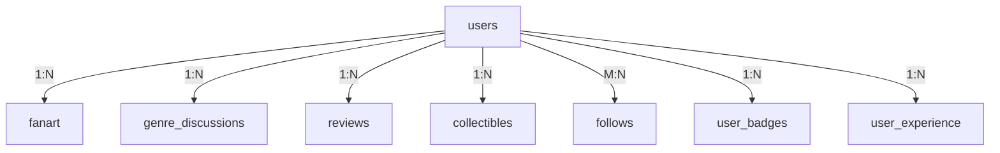

# 🌟 AnimeVerse

> A vibrant community-driven platform designed to connect anime enthusiasts from around the world. Whether you're a casual fan or a hardcore otaku, AnimeVerse offers a comprehensive suite of features to enhance your anime experience.

[](https://www.php.net/)
[](https://www.mysql.com/)
[](LICENSE)

## 📋 Table of Contents

- [Features](#-features)
- [Technology Stack](#-technology-stack)
- [Installation](#-installation)
- [Project Structure](#-project-structure)
- [Usage](#-usage)
- [Database Schema](#-database-schema)
- [Contributing](#-contributing)
- [License](#-license)

## ✨ Features

### 🎨 **Fan Art Gallery**
- Upload and showcase your anime-inspired artwork
- Comment and heart system for community engagement
- Image quality validation and fallback handling

### 💬 **Discussion Forums**
- Genre-based discussion threads (Action, Comedy, Romance, Drama, etc.)
- Community-driven conversations with threaded replies
- Active moderation and content management

### 🗳️ **Polls & Debates**
- Create and participate in anime-related polls
- Structured debate system with voting mechanisms
- Real-time results and community insights

### ⭐ **Anime Reviews & Ratings**
- Comprehensive anime review system with 1-10 rating scale
- Detailed anime information with rating statistics
- Spoiler alert system for sensitive content

### 🎪 **Virtual Collectibles Marketplace**
- Buy, sell, and trade virtual anime collectibles
- Virtual currency system
- Item rarity and pricing mechanisms

### 👥 **Social Features**
- Dual profile system (Standard & Instagram-style)
- Follow/unfollow system with activity feeds
- User badges and experience point system
- Achievement levels and gamification

### 🏷️ **Spoiler Management**
- Advanced spoiler tagging across all content types
- Click-to-reveal spoiler system
- Customizable spoiler warnings

## 🛠️ Technology Stack

### **Backend**
- **PHP 7+**: Native PHP implementation without external frameworks
- **MySQL/MariaDB**: Relational database for data persistence
- **PDO**: Secure database interactions with prepared statements

### **Frontend**
- **HTML5 & CSS3**: Modern responsive design
- **JavaScript**: Interactive UI components and AJAX operations
- **Custom CSS**: Themed styling with brown color scheme (#8B4513 to #D2691E)

### **Architecture**
- **MVC Pattern**: Clean separation of concerns
- **Front Controller**: Centralized request routing through `index.php`
- **Session Management**: PHP sessions for user authentication
- **Security**: Password hashing, XSS protection, and SQL injection prevention

### **Development Environment**
- **XAMPP**: Local development stack (Apache, MySQL, PHP)
- **Production**: LAMP stack compatible

## 🚀 Installation

### Prerequisites
- PHP 7.0 or higher
- MySQL 5.7 or higher
- Apache web server
- XAMPP (recommended for local development)

### Setup Instructions

1. **Clone the repository**
   ```bash
   git clone https://github.com/yourusername/animeverse.git
   cd animeverse
   ```

2. **Set up the database**
   ```sql
   -- Create database
   CREATE DATABASE animeverse;
   
   -- Import schema and data
   mysql -u root -p animeverse < animeverse.sql
   
   -- Apply feature updates (if needed)
   mysql -u root -p animeverse < database_updates.sql
   ```

3. **Configure database connection**
   - Edit `db.php` with your database credentials:
   ```php
   $host = 'localhost';
   $dbname = 'animeverse';
   $user = 'root';
   $pass = ''; // Your MySQL password
   ```

4. **Deploy to web server**
   - Copy files to your web server directory (e.g., `htdocs` for XAMPP)
   - Ensure proper file permissions

5. **Access the application**
   ```
   http://localhost/animeverse/
   ```

## 📁 Project Structure

```
AnimeVerse/
├── 📁 controller/           # Business logic and request handling
│   ├── animereviewcontroller.php
│   ├── badgecontroller.php
│   ├── collectiblescontroller.php
│   ├── discussioncontroller.php
│   ├── fanartcontroller.php
│   ├── followcontroller.php
│   ├── homecontroller.php
│   ├── logincontroller.php
│   ├── myprofilecontroller.php
│   ├── polldebatecontroller.php
│   ├── profilecontroller.php
│   ├── registercontroller.php
│   ├── reviewcontroller.php
│   └── spoilercontroller.php
├── 📁 model/               # Data access and business logic
│   ├── animereviewmodel.php
│   ├── badgemodel.php
│   ├── collectiblemodel.php
│   ├── discussionmodel.php
│   ├── fanartmodel.php
│   ├── followmodel.php
│   ├── genremodel.php
│   ├── homemodel.php
│   ├── myprofilemodel.php
│   ├── polldebatemodel.php
│   ├── reviewmodel.php
│   ├── spoilermodel.php
│   └── usermodel.php
├── 📁 view/                # User interface templates
│   ├── animereviewview.php
│   ├── badgeview.php
│   ├── collectiblesview.php
│   ├── discussionview.php
│   ├── fanartview.php
│   ├── followview.php
│   ├── homeview.php
│   ├── loginview.php
│   ├── myprofileview.php
│   ├── polldebateview.php
│   ├── profileview.php
│   ├── registerview.php
│   ├── reviewview.php
│   ├── spoilerview.php
│   └── userprofileview.php
├── 📁 css/                 # Stylesheets for each feature
│   ├── animereview.css
│   ├── badge.css
│   ├── collectibles.css
│   ├── discussion.css
│   ├── fanart.css
│   ├── follow.css
│   ├── home.css
│   ├── login.css
│   ├── myprofile.css
│   ├── poll.css
│   ├── profile.css
│   ├── register.css
│   ├── review.css
│   └── spoiler.css
├── 📄 index.php            # Front controller and entry point
├── 📄 db.php               # Database connection configuration
├── 📄 auth.php             # Authentication utilities
├── 📄 animeverse.sql       # Database schema and initial data
├── 📄 database_updates.sql # Feature updates and enhancements
└── 📄 README.md            # Project documentation
```

## 🎯 Usage

### **Getting Started**
1. **Register**: Create a new account or login with existing credentials
2. **Explore**: Browse discussions, fan art, and collectibles
3. **Engage**: Participate in polls, write reviews, and join debates
4. **Collect**: Trade virtual collectibles and earn experience points
5. **Connect**: Follow other users and build your anime community

### **Key Pages**
- **Home**: `/?page=home` - Dashboard and recent activity
- **Fan Art**: `/?page=fanart` - Upload and browse artwork
- **Discussions**: `/?page=discussion` - Genre-based forums
- **Reviews**: `/?page=animereview` - Anime ratings and reviews
- **Collectibles**: `/?page=collectibles` - Virtual marketplace
- **Polls**: `/?page=polldebate` - Community polls and debates
- **Profile**: `/?page=myprofile` - User profile management
- **Badges**: `/?page=badge` - Achievement system

## 🗄️ Database Schema

### **Core Tables**
- `users` - User accounts and profiles
- `fanart` - Fan art submissions and metadata
- `genre_discussions` - Discussion threads by anime genre
- `polls` & `debates` - Voting and debate systems
- `collectibles` - Virtual marketplace items
- `reviews` - Anime reviews and ratings

### **Social Features**
- `follows` - User relationship tracking
- `user_badges` - Achievement system
- `user_experience` - Gamification and XP tracking
- `spoiler_tags` - Content spoiler management

### **Entity Relationships**


## 🎨 Design Philosophy

### **User Experience**
- **Responsive Design**: Optimized for desktop and mobile devices
- **Intuitive Navigation**: Clean, organized interface with consistent theming
- **Visual Hierarchy**: Strategic use of colors, typography, and spacing
- **Performance**: Optimized loading times and efficient database queries

### **Color Scheme**
- **Primary**: AnimeVerse brown theme (#8B4513 to #D2691E)
- **Secondary**: Complementary gradient backgrounds (#667eea to #764ba2)
- **Consistent**: Unified visual language across all components

## 🔒 Security Features

- **Authentication**: Secure login system with password hashing
- **Input Validation**: Comprehensive sanitization and validation
- **SQL Injection Prevention**: PDO prepared statements
- **XSS Protection**: Output escaping and content filtering
- **Session Management**: Secure session handling and timeout

## 🤝 Contributing

We welcome contributions from the anime community! Here's how you can help:

1. **Fork the repository**
2. **Create a feature branch**: `git checkout -b feature/amazing-feature`
3. **Commit your changes**: `git commit -m 'Add amazing feature'`
4. **Push to the branch**: `git push origin feature/amazing-feature`
5. **Open a Pull Request**

### **Development Guidelines**
- Follow MVC architecture patterns
- Maintain consistent code formatting
- Add comments for complex logic
- Test thoroughly before submitting
- Update documentation as needed

### **Feature Requests**
- Use GitHub Issues to propose new features
- Provide detailed descriptions and use cases
- Include mockups or wireframes when possible

## 📝 License

This project is licensed under the MIT License - see the [LICENSE](LICENSE) file for details.

## 🙏 Acknowledgments

- **Anime Community**: For inspiration and feedback
- **Contributors**: All developers who have contributed to this project
- **Open Source**: Built with love for the anime community

## 📞 Support

- **Issues**: [GitHub Issues](https://github.com/yourusername/animeverse/issues)
- **Discussions**: [GitHub Discussions](https://github.com/yourusername/animeverse/discussions)
- **Wiki**: [Project Wiki](https://github.com/yourusername/animeverse/wiki)

---

<div align="center">
  <strong>🌟 Join the AnimeVerse community and connect with fellow anime enthusiasts! 🌟</strong>
</div>